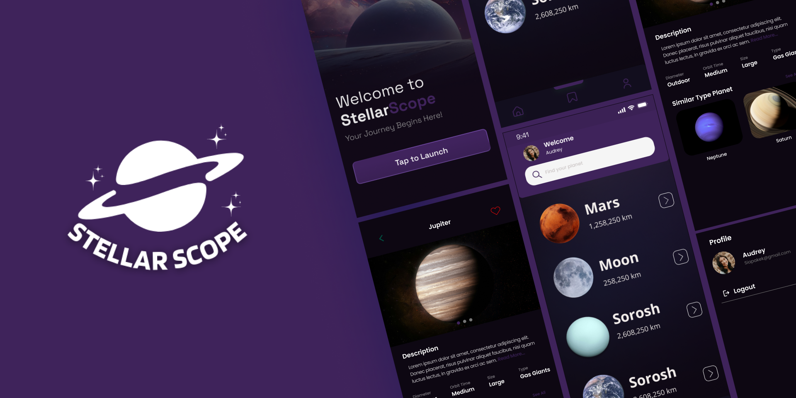

This repository was result for Jetpack Compose course on dicoding

## Overview 📃

Welcome to StellarScope, an engaging app designed to explore the wonders of space. Discover planets, learn fascinating facts, and embark on a journey through the cosmos, all from the comfort of your mobile device. Let your journey begin!

## Features 🚀

The application includes several features, such as:

- **Intuitive Interface**: Navigate through the vastness of space with a sleek and user-friendly design.
- **Planetary Details**: Learn about different planets, their descriptions, sizes, and types.
- **Search Functionality**: Easily find your favorite planet using the search bar.
- **Interactive Lists**: View a detailed list of planets with their respective distances.
- **Favorite Planets**: Save your favorite planets for quick access.
- **User Profiles**: Manage your profile and keep track of your journey.

## Getting Started 📝

**Cloned the repository**:

```bash
git clone https://github.com/Fhanafii/stellarscope.git
```

## Support 🤔

If you encounter any issues or have questions, feel free to reach out. You can also refer to the comments in the code for further guidance.

## Contributing ✨

Contributions are always welcome! If you have suggestions to enhance StellarScope, feel free to fork the repository, make your changes, and submit a pull request.
Let’s explore the universe together with StellarScope!
